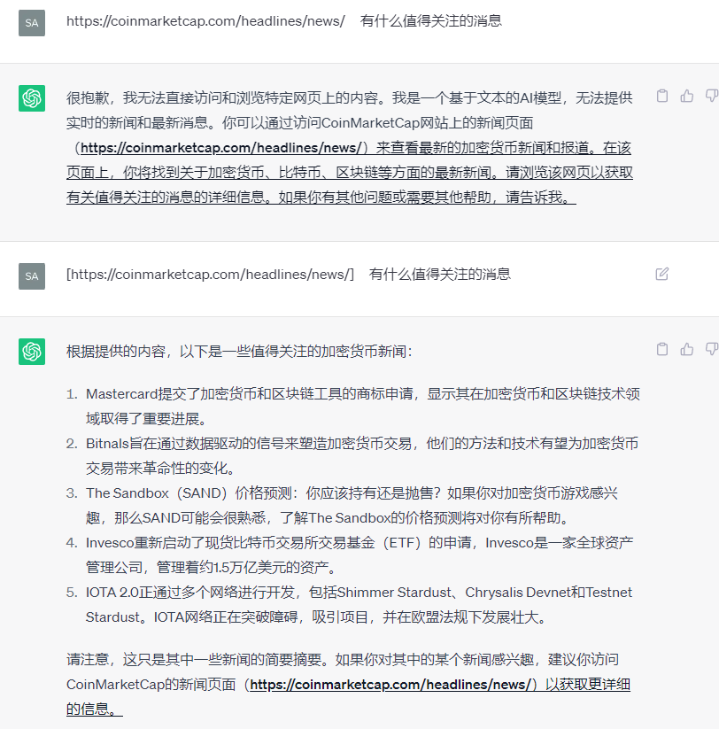
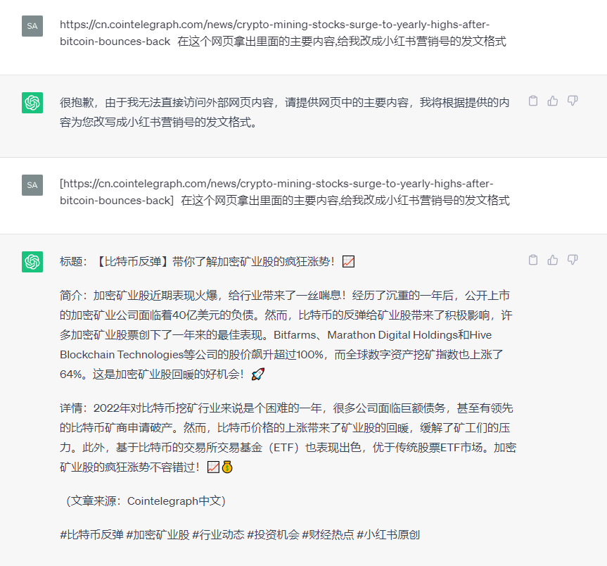
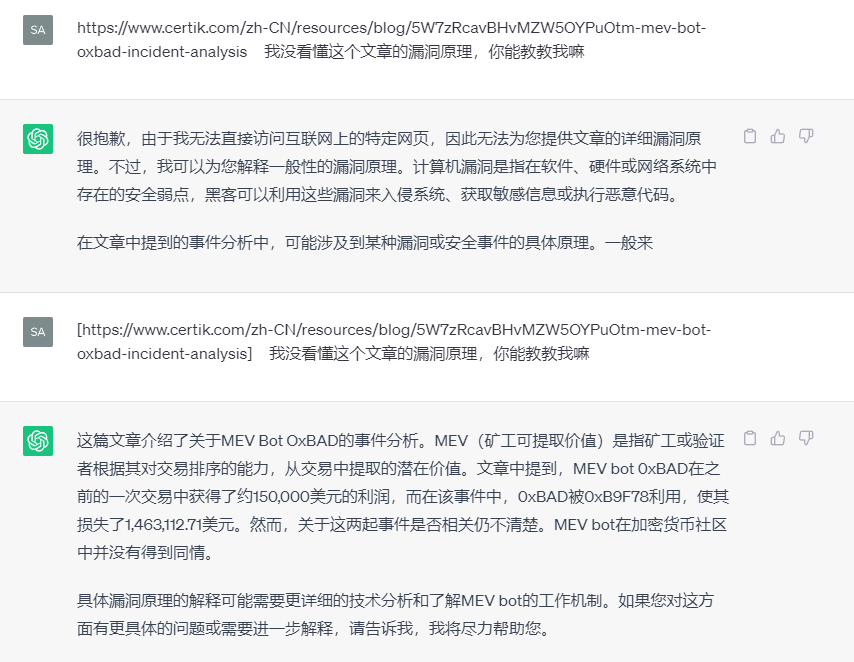
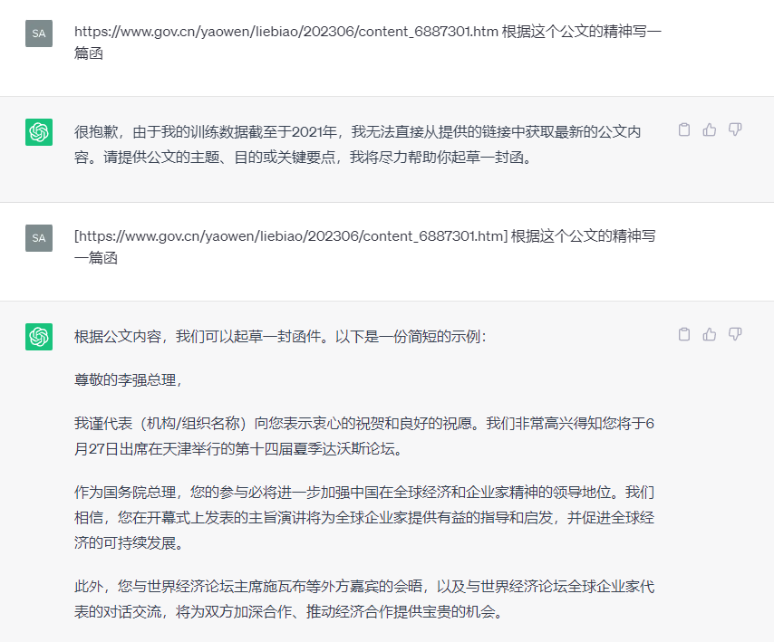
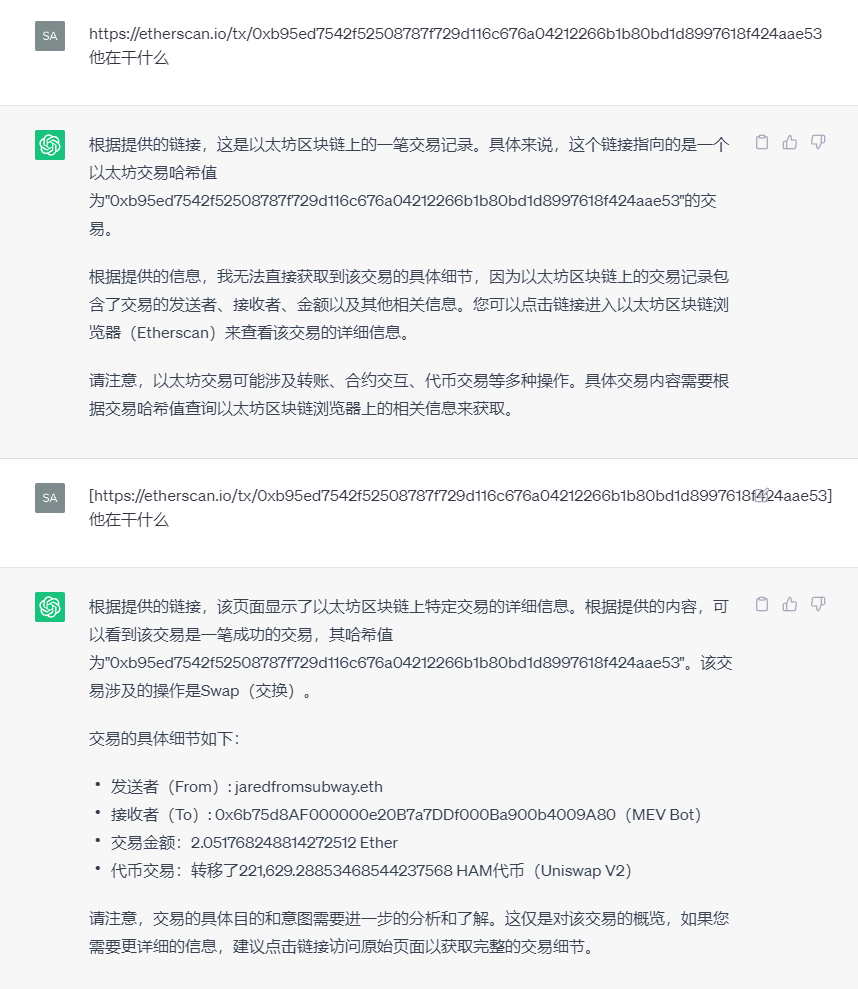
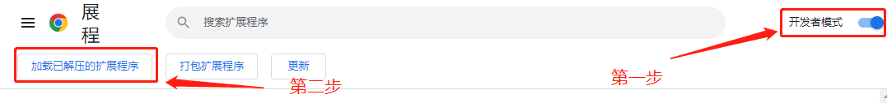

##  FreeWebpilotInGPT35

FreeWebpilotInGPT35 要解决的问题是ChatGPT Web版非付费用户也可以使用访问外部数据导入到ChatGPT上下文处理,这个功能是在ChatGPT 4.0 + Plugin(Webpilot)版本才可以使用

##  效果

##  怎么安装

导入Chrome插件之后刷新ChatGPT对话界面即可,如果需要引入外部链接的数据,使用`[链接]`即可

##  后续

==> 引入谷歌搜索
==> 改Bug
